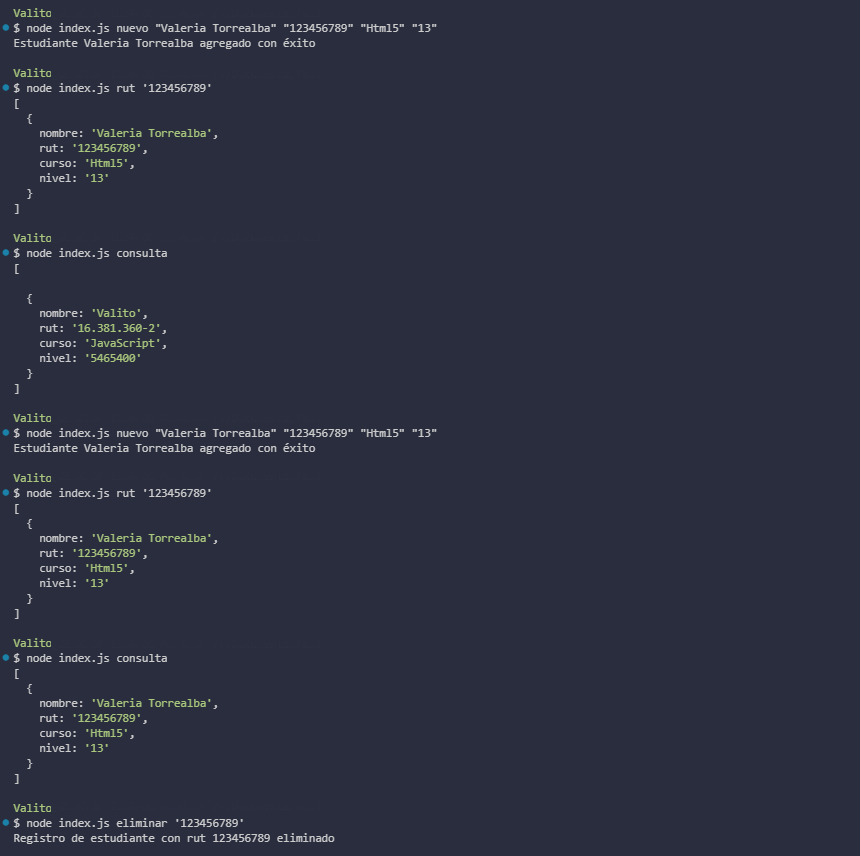

# Desafío evaluado - Always Music

## Descripción

La **escuela de música Always Music** desea modernizar su sistema de gestión de estudiantes, actualmente basado en Excel, migrando a una base de datos PostgreSQL. En este desafío, se requiere desarrollar una aplicación en Node.js que utilice el paquete `pg` para realizar operaciones CRUD (Crear, Leer, Actualizar, Eliminar) en una base de datos PostgreSQL.

El objetivo es implementar funcionalidades para agregar nuevos estudiantes, consultar los registros existentes, actualizar la información de un estudiante y eliminar registros, todo a través de la línea de comandos.

## Vista Codificada

A continuación, se muestra la imagen del resultado codificado:



## Requerimientos

1. **Registrar un nuevo estudiante**:
   - **Función**: `addStudent(nombre, rut, curso, nivel)`
   - **Descripción**: Crea una función asíncrona para agregar un nuevo estudiante a la base de datos.

2. **Consultar estudiante por RUT**:
   - **Función**: `getStudentByRut(rut)`
   - **Descripción**: Crea una función asíncrona para obtener el registro de un estudiante por su RUT y mostrarlo en la consola.

3. **Consultar todos los estudiantes**:
   - **Función**: `getAllStudents()`
   - **Descripción**: Crea una función asíncrona para obtener todos los estudiantes registrados y mostrar los resultados en la consola.

4. **Actualizar información de un estudiante**:
   - **Función**: `updateStudent(rut, nombre, curso, nivel)`
   - **Descripción**: Crea una función asíncrona para actualizar la información de un estudiante existente en la base de datos.

5. **Eliminar un estudiante**:
   - **Función**: `deleteStudent(rut)`
   - **Descripción**: Crea una función asíncrona para eliminar un registro de estudiante de la base de datos.

## Tecnologías Utilizadas

- **Node.js**: Entorno de ejecución para JavaScript en el servidor.
- **pg**: Paquete para interactuar con bases de datos PostgreSQL desde Node.js.
- **PostgreSQL**: Sistema de gestión de bases de datos relacional utilizado para almacenar los datos de los estudiantes.

## Instrucciones para Ejecutar el Proyecto

1. **Instalación de Dependencias**:
   - Clona el repositorio y navega al directorio del proyecto.
   - Ejecuta `npm install` para instalar las dependencias necesarias.

2. **Configurar la Base de Datos**:
   - Crea una base de datos PostgreSQL y una tabla con las siguientes columnas: Nombre, Rut, Curso, Nivel.
   - Usa las siguientes sentencias SQL para crear la tabla:
     ```sql
     CREATE TABLE estudiantes (
       id SERIAL PRIMARY KEY,
       nombre VARCHAR(100),
       rut VARCHAR(20) UNIQUE,
       curso VARCHAR(50),
       nivel VARCHAR(50)
     );
     ```

3. **Ejecutar el Servidor**:
   - Ejecuta `node index.js` para iniciar el script y realizar las operaciones CRUD desde la línea de comandos.

4. **Uso de las Funciones**:
   - Utiliza las funciones proporcionadas en el archivo `index.js` para interactuar con la base de datos. Puedes ejecutar el script y pasar argumentos desde la línea de comandos para probar cada funcionalidad.

## Autor

Este proyecto fue desarrollado por **Valeria Torrealba**.
